##### These procedure steps will be followed on the simulator

1. When you click on a Air Velocity using Vane Anemometer file, a new window will open as shown below. Click on the NEXT button at the bottom right corner to proceed to the next step.  
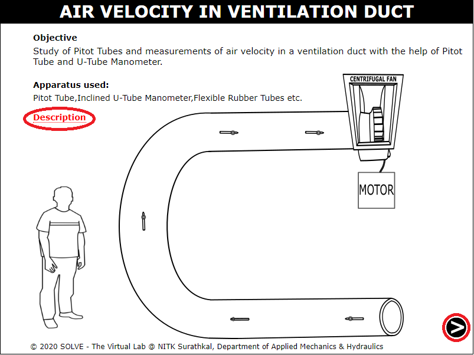 

2. Click on the slider to rotate so that current comes in the circuit board. 
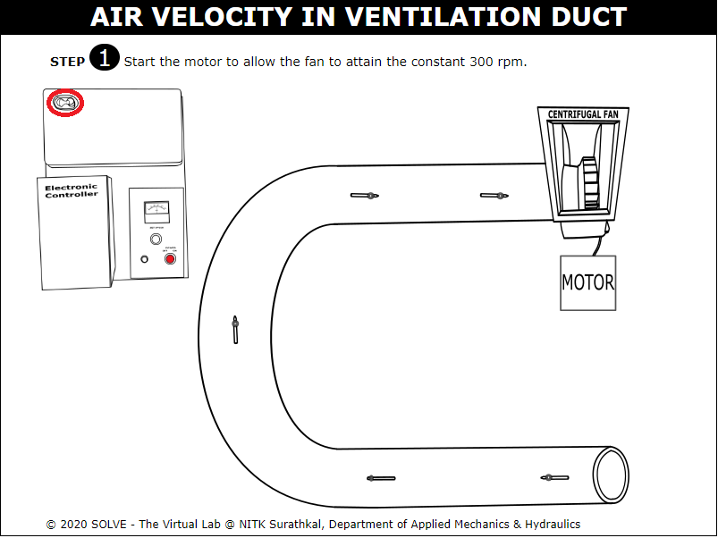 

3. Click on the power button to start the motor. 
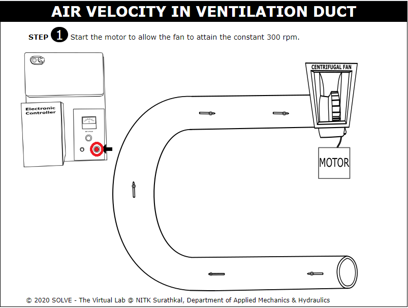 

4. Click on the knob to set rpm of 300 and click on the NEXT button at the bottom right corner to proceed to the next step.  
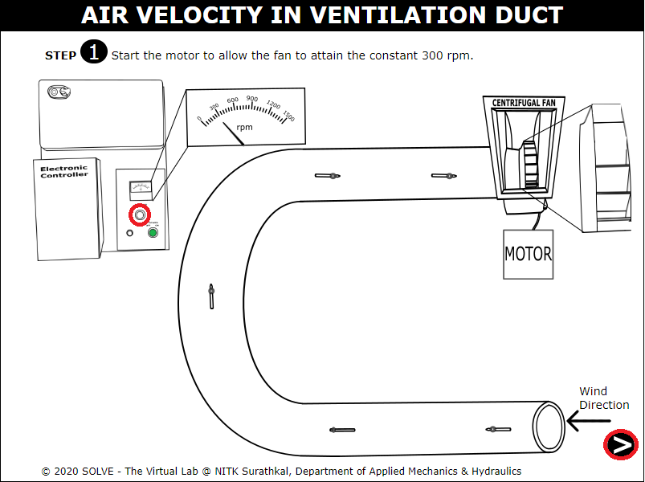 

5. Click on the hand to measure the inclination of manometer.  
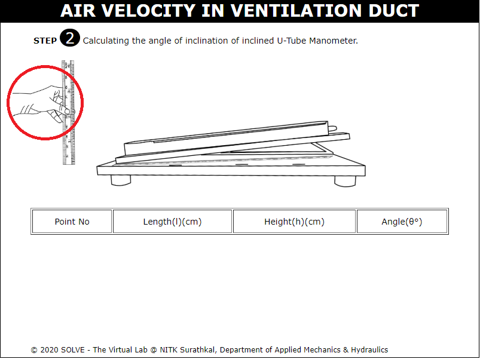 

6. Click on the OK button. 
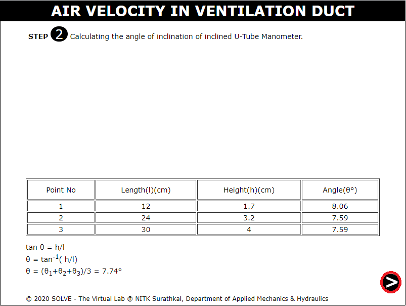 

7. Click on the hand to connect the rubber tube of manometer with pitot tube at point 1. 
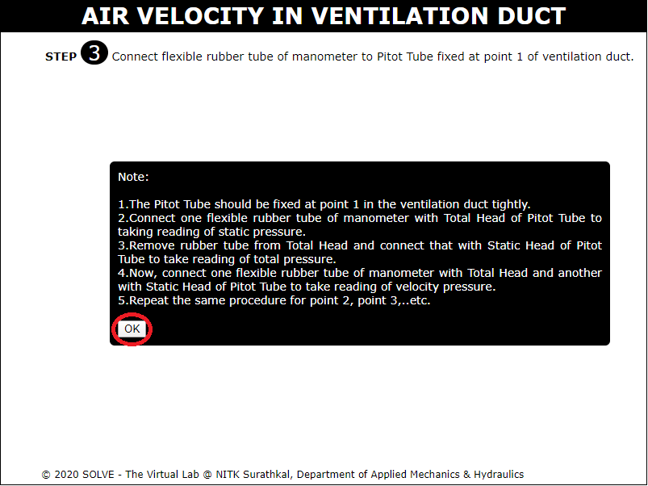 

8. Click on the big hand to take static head reading from manometer. 
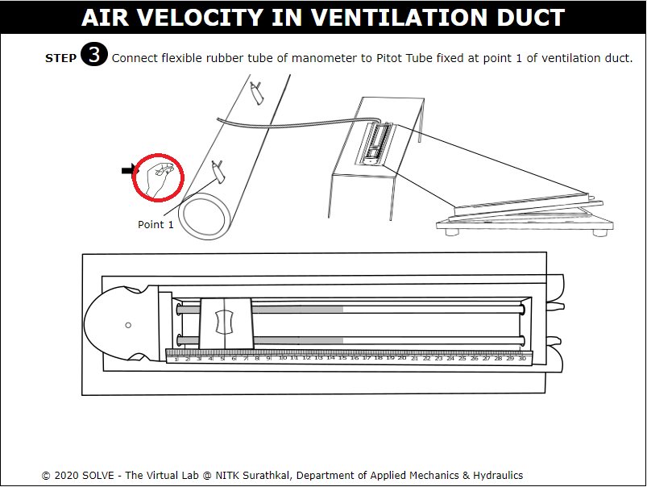 

9. Repeat the procedure no 9 and 10 for taking reading of total head and velocity head at point 1 in ventilation duct.  
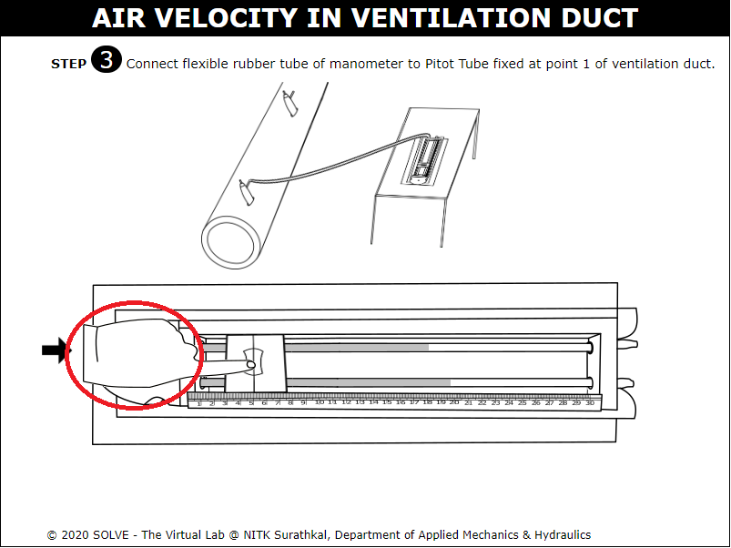 

10. Click on the NEXT button at the bottom right corner to proceed to the next step. 
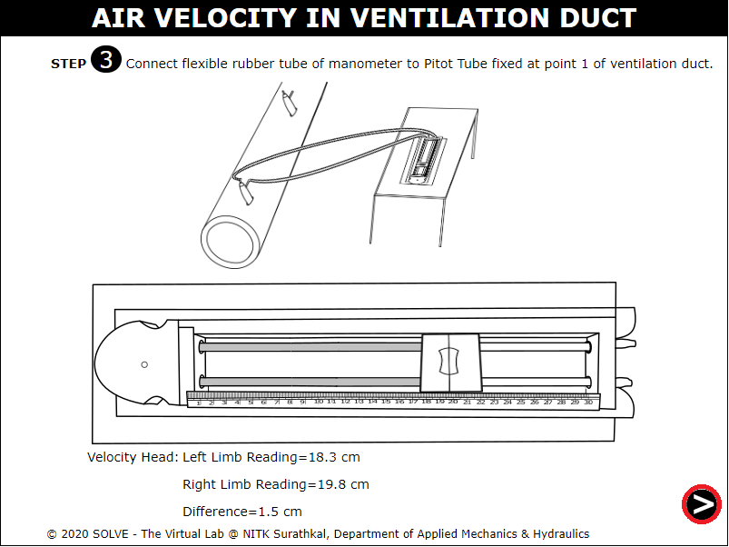 

11. The observation for point 1 is given below and put the required value in calculation to check your results. 
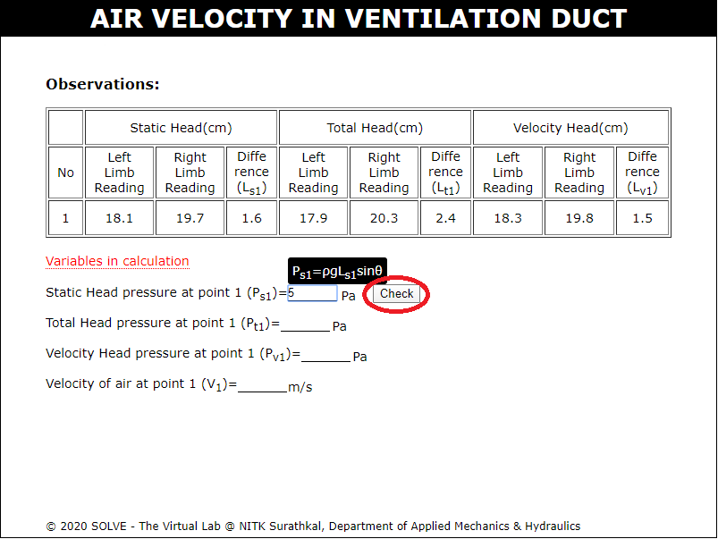 

12. Click on the NEXT button at the bottom right corner to proceed to the next step. 
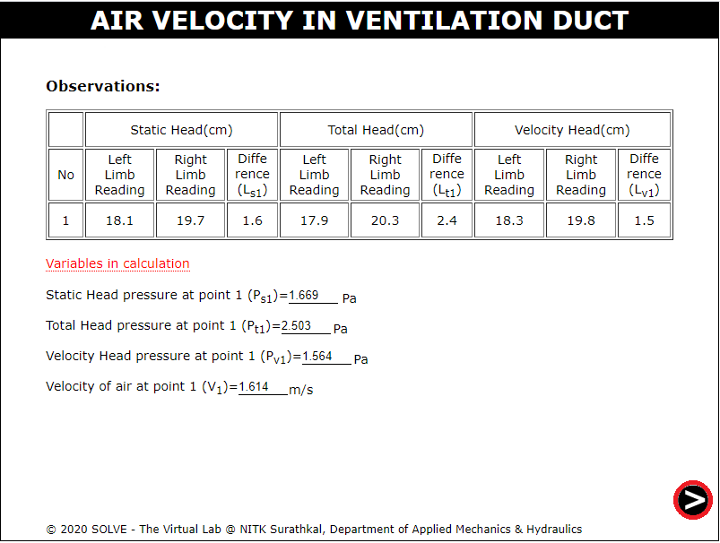 

13. Click on the hand to connect the rubber tube of manometer with pitot tube at point 2. 
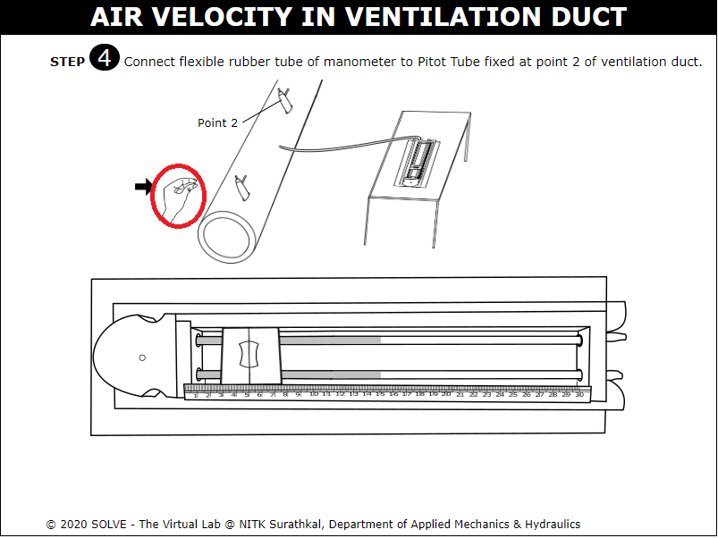 

14. Click on the big hand to take static head reading from manometer. 
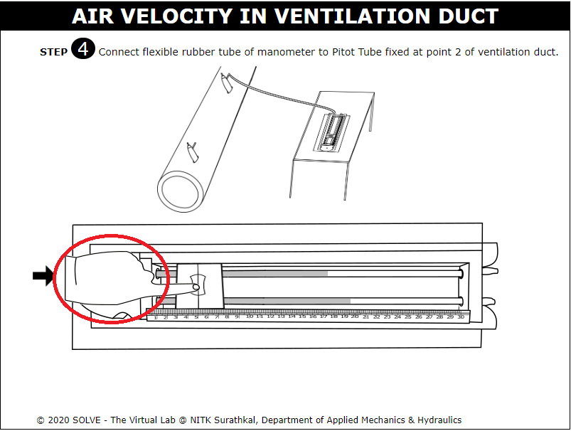 

15. Repeat the procedure no 9 and 10 for taking reading of total head and velocity head at point 1 in ventilation duct.Click on the NEXT button at the bottom right corner to proceed to the next step. 
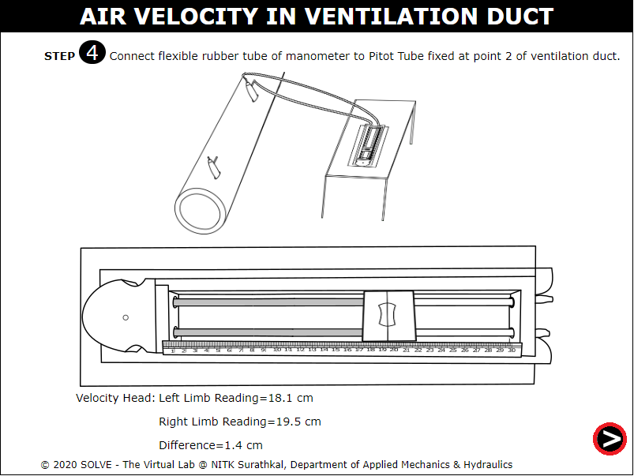 

16. The observation for point 2 is given below and put the required value in calculation to check your results. 
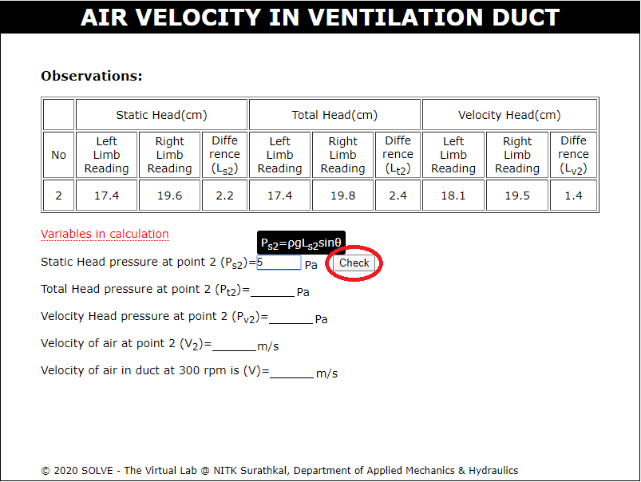 

17. Click on the NEXT button at the bottom right corner to proceed to the next step.Repeat all the steps for 400 rpm. 
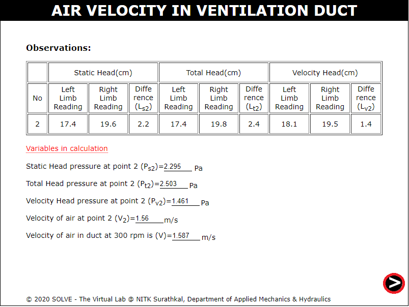 

18. The Result for 300 rpm and 400 rpm is given below. 
 
